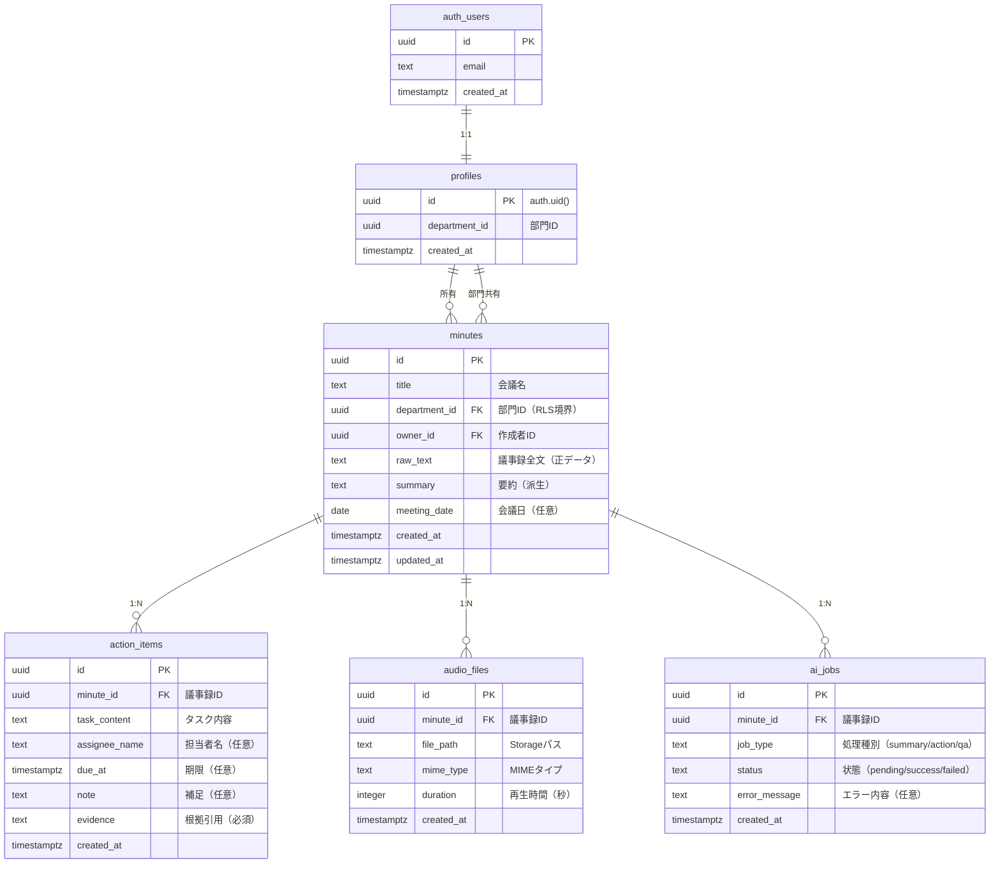

# 設計書：meeting-record

本設計書は、GitHub Issue（1〜11）、REQUIREMENTS.md、および CLAUDE.md に基づいて作成される。
記載のない仕様は実装しない。

---

## 目次

1. [設計方針](#1-設計方針)
2. [機能仕様（機能一覧）](#2-機能仕様機能一覧)
3. [構造仕様（ER図・テーブル定義）](#3-構造仕様er図テーブル定義)
4. [AI機能共通仕様](#4-ai機能共通仕様)
5. [セキュリティ・権限制御](#5-セキュリティ権限制御)
6. [非機能要件](#6-非機能要件)

---

## 1. 設計方針

### 1.1 データ設計の基本方針

#### 正データと派生データ
- **正データ**：`minutes.raw_text`（AI で改変禁止）
- **派生データ**：`summary` / `action_items` / QA 結果（再生成前提）

#### 設計ゴール
- 型・制約・用途を明示し、AI の推測余地を排除
- NULL は「不明・未言及」を表す（推測で埋めない）
- 外部キーは原則 `ON DELETE CASCADE`

### 1.2 アーキテクチャ方針

- **Server Components を優先**し、Client Components は必要最小限に抑える
- **Gemini API は必ずサーバー側で実行**
- API キーはクライアントに露出させない
- **RLS（Row Level Security）** をDBレベルで担保し、フロント制御に依存しない

### 1.3 UI/UX 方針

- ログインなしでもAI体験ができることを最優先
- AIは **自動実行しない**（必ずボタン操作）
- 保存操作時のみログイン誘導を行い、二度手間を避ける
- 「AI機能はボタンを押すと実行されます」を明示

### 1.4 品質方針（TDD）

- Red → Green → Refactor のサイクルを厳守
- テストは「仕様の担保」であり「実装詳細の確認」はしない
- Issue に書かれている仕様だけをテストする

---

## 2. 機能仕様（機能一覧）

### 2.1 機能一覧表

| 機能ID | 機能名 | 概要 | Issue | ゲスト | ログイン後 |
|--------|--------|------|-------|--------|-----------|
| F-001 | 認証 | Email/Password認証（Supabase Auth） | Issue 1 | - | ○ |
| F-002 | 部門共有・RLS | 部門境界によるアクセス制御 | Issue 2 | - | ○ |
| F-003 | raw_text 入力 | 議事録全文の入力（最大30,000文字） | Issue 5 | ○ | ○ |
| F-004 | AI要約 | raw_text を要約（創作禁止） | Issue 7 | ○（表示のみ） | ○（保存可） |
| F-005 | AIアクション抽出 | タスクを構造化抽出（根拠必須） | Issue 8 | ○（表示のみ） | ○（保存可） |
| F-006 | AI QA | 議事録内容への質問応答（根拠必須） | Issue 9 | ○（表示のみ） | ○ |
| F-007 | 議事録保存 | minutes として DB 保存 | Issue 5 | - | ○ |
| F-008 | 議事録一覧・詳細 | 保存済み議事録の閲覧 | Issue 6 | - | ○ |
| F-009 | 議事録検索 | title / meeting_date / raw_text で検索 | Issue 10 | - | ○ |
| F-010 | 音声アップロード | m4a 形式の音声ファイル保存 | Issue 4 | - | ○ |

### 2.2 機能詳細

#### F-001：認証（Issue 1）

**目的**
- 企業がログインなしでAI機能を即体験できる
- 保存・共有・検索・音声アップロードはログイン後のみに制限

**認証方式**
- Supabase Auth（Email / Password）
- Confirm Email：必須にしない（デモ用途）

**ゲストで可能なこと（未ログイン）**
- raw_text を入力して AI を実行できる
- AI結果を画面表示できる
- DBへの永続保存は不可

**ログイン後に可能なこと**
- minutes / action_items の保存・編集・削除
- 保存済み一覧 / 検索
- 音声アップロード

**profiles 自動作成**
- ログイン直後に `profiles` レコードが存在しなければ作成
- `profiles.id = auth.uid()` に一致させる
- `department_id` を必ずセット（「1人=1部門」）

**受け入れ条件**
- [ ] 未ログインでも AI（要約/抽出/QA）を実行できる
- [ ] 未ログインで保存を試みるとログイン誘導される
- [ ] ログイン後、profiles が必ず作成され department_id が入る
- [ ] ログイン後のみ DB 永続保存が可能

---

#### F-002：部門共有・RLS（Issue 2）

**目的**
- 保存された議事録データについて **DBレベルで** 権限を保証
- 同部門：閲覧可
- 作成者：編集/削除可

**権限仕様**

**minutes**
- SELECT：自分の department_id と一致する minutes のみ
- INSERT：owner_id=auth.uid() かつ department_id は自分の profiles.department_id
- UPDATE/DELETE：owner_id=auth.uid() のみ

**action_items / audio_files / ai_jobs**
- SELECT：親 minutes が自部門のもののみ
- INSERT：親 minutes が owner_id=auth.uid() のものにのみ作成可
- UPDATE/DELETE：親 minutes が owner_id=auth.uid() のもののみ

**Storage（音声）**
- bucket：`audio`
- パス：`{department_id}/{minute_id}/{timestamp}_{filename}`
- 読み取り：同部門のみ
- 書き込み：親 minutes.owner_id=auth.uid() の minute_id のみ

**受け入れ条件**
- [ ] 他部門の minutes を SELECT できない
- [ ] 同部門でも他人の minutes を UPDATE/DELETE できない
- [ ] action_items 等の子テーブルも同様に隔離される
- [ ] Storage も同部門以外は参照できない

---

#### F-003：raw_text 入力（Issue 5）

**目的**
- 文字起こしテキスト（raw_text）を正データとして扱い、AI処理の入力元にする

**仕様**
- raw_text 最大文字数：30,000
- raw_text は AI で改変しない
- ゲスト：入力→AI実行→表示（保存不可）
- ログイン後：minutes 作成として保存可能

**入力UI**
- raw_text テキストエリア
- 文字数カウンタ（上限超過がわかる）

**保存UI**
- 未ログイン：「保存」→ログイン誘導
- ログイン済：
  - title（必須）
  - meeting_date（任意）
  - raw_text（必須）
  を minutes に保存

**受け入れ条件**
- [ ] 30,000文字を超える入力はエラーになる
- [ ] ゲストでもAI体験ができる
- [ ] 未ログインで保存はできずログイン誘導される
- [ ] ログイン後に minutes が保存される（raw_text NOT NULL）

---

#### F-004：AI要約（Issue 7）

**目的**
- 長文の会議テキストを、意思決定と次アクションが分かる形で要約

**仕様**
- Gemini API（サーバー側）で要約生成
- 創作禁止（raw_textにない内容は出さない）
- ゲスト：表示のみ
- ログイン後：minutes.summary に保存可能

**出力品質要件**
- 読みやすさ優先（箇条書き主体）
- raw_textに存在する範囲で、最低限以下を含める
  - 決定事項（何が決まったか）
  - 主要論点（何が議論されたか）
  - 次アクションの方向性（誰が/期限はIssue8側で確定するため、ここでは無理に断定しない）

**受け入れ条件**
- [ ] ゲストで要約が生成・表示される
- [ ] 制限超過/失敗時に適切なメッセージが出る
- [ ] キャッシュが効き、同一入力でGeminiを再呼び出ししない
- [ ] ログイン後に minutes.summary として保存できる

---

#### F-005：AIアクション抽出（Issue 8）

**目的**
- 会議の成果を「次のアクション」に変換する（アプリのコア価値）
- タスクを構造化し、担当・期限が不明なら無理に埋めずNULLで保持

**仕様**
- Gemini API（サーバー側）
- 出力は固定フォーマット（JSON構造）で返す（必須）
- **出力は必ずJSONとしてパース可能であること（パース不能は失敗扱い）**
- evidence（根拠引用）必須
- ゲスト：表示のみ
- ログイン後：action_items として保存可能

**出力フォーマット（必須：この形以外は失敗扱い）**
- JSON配列（必ず配列）
- 各要素は以下キーを必ず持つ（キー欠落は失敗扱い）
  - task_content（タスク内容：文字列、必須）
  - assignee_name（担当者名：文字列 or null）
  - due_at（期限：文字列（ISO想定） or null）
  - note（補足：文字列 or null）
  - evidence（根拠引用：文字列、必須）

```json
[
  {
    "task_content": "タスク内容",
    "assignee_name": null,
    "due_at": null,
    "note": null,
    "evidence": "raw_textからの引用"
  }
]
```

**ルール**
- due_at は推測禁止（言及がなければ null）
- assignee_name も推測禁止（言及がなければ null）
- evidence は必ず raw_text の引用（創作防止）

**保存仕様（ログイン後のみ）**
- minutes が未保存の場合：先に minutes 保存へ誘導
- 保存時：
  - action_items.minute_id = minutes.id
  - evidence NOT NULL を必ず満たす

**受け入れ条件**
- [ ] ゲストで抽出→表示できる
- [ ] 返却値が必ずJSONとしてパースできる（パース不能は失敗扱い）
- [ ] evidence が必ず存在する（空は不可）
- [ ] 不明な期限/担当は null になる（推測しない）
- [ ] ログイン後に action_items として保存できる

---

#### F-006：AI QA（Issue 9）

**目的**
- 会議内容を後から"聞き返さずに"確認できる状態を作る

**仕様**
- Gemini API（サーバー側）
- 入力：question + raw_text
- 出力：answer + evidence（根拠引用）
- ルール：
  - 根拠が取れない場合、必ず **「記載がありません」**
  - 外部知識・他議事録を混ぜない（raw_textに限定）
- question 文字数制限：800

**受け入れ条件**
- [ ] ゲストでQAが実行できる
- [ ] answer と evidence が表示される
- [ ] 根拠がない場合は「記載がありません」になる
- [ ] 外部知識の断定が出ない

---

#### F-007：議事録保存（Issue 5）

**目的**
- ログイン後のみ、議事録を永続化

**仕様**
- minutes テーブルに保存
  - title（必須）
  - meeting_date（任意）
  - raw_text（必須）
  - owner_id = auth.uid()
  - department_id = profiles.department_id
- summary は AI要約実行後に保存可能

**受け入れ条件**
- [ ] ログイン後のみ保存できる
- [ ] raw_text NOT NULL が担保される
- [ ] owner_id と department_id が正しく設定される

---

#### F-008：議事録一覧・詳細（Issue 6）

**目的**
- ゲストがログインなしでAI機能を即体験できる導線を作る
- 保存済み議事録を閲覧できる状態にする
- 初見ユーザーが「音声を入れたら勝手にAIが動く」と誤解しないUIにする

**画面要件**

**ゲストトップ画面（最重要・ログインなしで表示）**

表示要素（必須）：
- raw_text 入力テキストエリア（貼り付け可能）
- 文字数カウンタ（上限：30,000文字）
- サンプル操作ボタン
  - 「サンプル議事録を挿入」（開発プロジェクト進捗定例のサンプルを入力欄にセット）
  - 「クリア」（入力欄を空にする）
- AI実行ボタン（必ず明示して配置）
  - 「要約を生成」
  - 「アクションを抽出」
  - 「質問する（QA）」
- 結果表示エリア（要約/アクション/QAを分けて見せる）
- 保存ボタン（ログイン必須機能）
  - 未ログイン：押下でログイン誘導（モーダルまたはログインページ遷移）
  - ログイン済：保存フローへ（Issue5）

初期状態（必須）：
- 画面初期表示時点で、raw_text欄に「サンプル議事録（開発進捗定例）」が入っている状態
- 初期サンプルであることが分かる表示（例：「サンプルが入力されています。自由に編集/貼り付けできます」）

誤解防止の文言（必須）：
- 「AI機能はボタンを押すと実行されます（自動では実行されません）」
- 「このアプリは入力テキスト（raw_text）を元にAI処理します」
- 「保存・共有・検索・音声アップロードはログイン後に利用できます」
- 「AIは入力テキストにない内容を創作しません」

実装上の注意（必須）：
- AIの自動実行は禁止（ページ表示時に勝手にAPIを叩かない）
- サンプル挿入は「固定テキストを入力欄にセット」するだけ（DB保存はしない）
- サンプルは採用担当が読んでリアルに感じる粒度（決定事項、論点、次アクション候補が含まれる）
- raw_text上限（30,000文字）超過時はボタンを押せない、またはエラーを表示する
- ゲストで保存機能に触れた時のみログイン要求（= 二度手間を増やさない）

**一覧画面（ログイン後）**
- 同部門の minutes を一覧表示
- title / meeting_date / created_at で並び替え

**詳細画面（ログイン後）**
- raw_text（正データ）
- summary（派生、存在する場合）
- action_items（派生、存在する場合）
- 音声アップロードUI（ログイン時のみ）

**受け入れ条件**
- [ ] 未ログインでゲストトップが表示され、初期状態でサンプル議事録が入っている
- [ ] 「サンプル議事録を挿入」ボタンでいつでもサンプルを再投入できる
- [ ] 「クリア」ボタンで入力欄を空にできる
- [ ] AIはボタン押下でのみ実行される（自動実行されない）
- [ ] 未ログインで「保存」を押すとログイン誘導され、保存はできない
- [ ] 誤解防止の文言が画面に表示されている
- [ ] ログイン後に一覧が閲覧できる
- [ ] 詳細画面で raw_text / summary / action_items が表示される
- [ ] 他部門のデータは表示されない

---

#### F-009：議事録検索（Issue 10）

**目的**
- 保存された議事録を後からすぐ探せる状態にする

**仕様**
- ログイン後のみ
- 検索対象：
  - minutes.title（部分一致）
  - minutes.meeting_date（範囲）
  - minutes.raw_text（簡易部分一致）
- 結果は部門内に限定（RLSで担保）

**受け入れ条件**
- [ ] 条件指定でminutes一覧が絞り込める
- [ ] 他部門データは検索結果に一切出ない
- [ ] UIで検索条件が分かる

---

#### F-010：音声アップロード（Issue 4）

**目的**
- iPhone録音アプリの音声（m4a）をアップロードし、議事録に紐付けて保存

**仕様**
- ログイン後のみ利用可能
- 許可MIME：`audio/mp4`（m4a）
- サイズ上限：20MB
- 保存先：Supabase Storage
  - bucket：`audio`
  - path：`{department_id}/{minute_id}/{timestamp}_{originalFilename}`
- DB記録：audio_files に insert

**バリデーション**
- MIMEが一致しない場合はアップロード不可
- サイズ超過はアップロード不可

**受け入れ条件**
- [ ] 20MB以内のm4aがアップロードできる
- [ ] 許可外形式/サイズは弾かれる
- [ ] audio_filesに正しいレコードが作成される
- [ ] RLS/権限により他部門・他人のminutesへ紐付けできない

---

## 3. 構造仕様（ER図・テーブル定義）

### 3.1 ER図（Mermaid記法）



### 3.2 テーブル定義詳細

#### 3.2.1 profiles（ユーザー・部門情報）

| カラム名 | 日本語名 | 用途 | 型 | NULL | デフォルト/制約 |
|---------|---------|------|-----|------|----------------|
| id | ユーザーID | auth.uid() と一致させるPK | uuid | NOT NULL | PK（auth.users.id と1:1運用） |
| department_id | 部門ID | RLSの部門境界 | uuid | NOT NULL | - |
| created_at | 作成日時 | 監査用 | timestamptz | NOT NULL | default now() |

**補足**
- 1人 = 1部門（department_id は1つだけ持つ）
- department_id の入力UIはスコープ外（暫定運用でOK）

---

#### 3.2.2 minutes（議事録）

| カラム名 | 日本語名 | 用途 | 型 | NULL | デフォルト/制約 |
|---------|---------|------|-----|------|----------------|
| id | 議事録ID | PK、子テーブル参照 | uuid | NOT NULL | PK, default gen_random_uuid() |
| title | 会議名 | 一覧表示・識別 | text | NOT NULL | - |
| department_id | 部門ID | 部門共有境界（RLS） | uuid | NOT NULL | profiles.department_id と一致必須 |
| owner_id | 作成者ID | 編集/削除権限 | uuid | NOT NULL | auth.uid() |
| raw_text | 議事録全文（正データ） | AI入力元。改変禁止 | text | NOT NULL | 最大30,000文字（アプリ側で制限） |
| summary | 要約（派生） | AI要約結果。再生成可 | text | NULL | NULLは未生成を意味 |
| meeting_date | 会議日 | 日付検索・並び替え | date | NULL | 不明ならNULL |
| created_at | 作成日時 | 監査用 | timestamptz | NOT NULL | default now() |
| updated_at | 更新日時 | 監査用 | timestamptz | NOT NULL | default now()（更新時に更新） |

**推奨制約/チェック**
- raw_text 文字数制限：`CHECK (char_length(raw_text) <= 30000)`（任意）
- `department_id` はフロント入力に頼らずDB側で担保（RLSで強制）

**インデックス**
- `department_id`
- `owner_id`
- `meeting_date`

---

#### 3.2.3 action_items（アクションプラン）

| カラム名 | 日本語名 | 用途 | 型 | NULL | デフォルト/制約 |
|---------|---------|------|-----|------|----------------|
| id | アクションID | PK | uuid | NOT NULL | PK, default gen_random_uuid() |
| minute_id | 議事録ID | minutes と紐付け | uuid | NOT NULL | FK → minutes(id) ON DELETE CASCADE |
| task_content | タスク内容 | 主要表示項目 | text | NOT NULL | 空文字禁止推奨 |
| assignee_name | 担当者名 | 会議内表記の担当者 | text | NULL | 不明ならNULL（推測禁止） |
| due_at | 期限 | 期限（日時） | timestamptz | NULL | 不明ならNULL（推測禁止） |
| note | 補足 | 背景/手順/前提 | text | NULL | 任意 |
| evidence | 根拠引用 | raw_text からの引用（創作防止） | text | NOT NULL | 必須（空禁止） |
| created_at | 作成日時 | 監査用 | timestamptz | NOT NULL | default now() |

**ルール（重要）**
- evidence は必須：AIが創作しないための証拠として必ず保存
- due_at が会議内で言及されていない場合は **NULL**（推測禁止）

**インデックス**
- `minute_id`
- `due_at`

---

#### 3.2.4 audio_files（音声ファイル）

| カラム名 | 日本語名 | 用途 | 型 | NULL | デフォルト/制約 |
|---------|---------|------|-----|------|----------------|
| id | 音声ID | PK | uuid | NOT NULL | PK, default gen_random_uuid() |
| minute_id | 議事録ID | minutes と紐付け | uuid | NOT NULL | FK → minutes(id) ON DELETE CASCADE |
| file_path | ファイルパス | Supabase Storageのパス | text | NOT NULL | `{department_id}/{minute_id}/...` |
| mime_type | MIMEタイプ | 形式判定（m4a） | text | NOT NULL | `audio/mp4` を想定 |
| duration | 再生時間（秒） | 表示/管理（任意） | integer | NULL | 不明ならNULL |
| created_at | 作成日時 | 監査用 | timestamptz | NOT NULL | default now() |

**インデックス**
- `minute_id`

---

#### 3.2.5 ai_jobs（AI実行履歴）

| カラム名 | 日本語名 | 用途 | 型 | NULL | デフォルト/制約 |
|---------|---------|------|-----|------|----------------|
| id | ジョブID | PK | uuid | NOT NULL | PK, default gen_random_uuid() |
| minute_id | 議事録ID | minutes と紐付け | uuid | NOT NULL | FK → minutes(id) ON DELETE CASCADE |
| job_type | 処理種別 | summary/action/qa | text | NOT NULL | CHECK in ('summary','action','qa') |
| status | 状態 | pending/success/failed | text | NOT NULL | CHECK in ('pending','success','failed') |
| error_message | エラー内容 | 失敗理由（内部向け） | text | NULL | 任意 |
| created_at | 作成日時 | 監査用 | timestamptz | NOT NULL | default now() |

**インデックス**
- `minute_id`
- `(job_type, status)`

---

### 3.3 削除連鎖（CASCADE）

すべての子テーブル（action_items、audio_files、ai_jobs）は、親 minutes が削除された際に **ON DELETE CASCADE** で自動削除される。

```sql
-- 例
ALTER TABLE action_items
  ADD CONSTRAINT fk_action_items_minute_id
  FOREIGN KEY (minute_id)
  REFERENCES minutes(id)
  ON DELETE CASCADE;
```

---

## 4. AI機能共通仕様

### 4.1 サーバー側実行（必須）

- Gemini API は必ずサーバー側で実行
- API キーは環境変数で管理
- クライアントにキーを露出させない

### 4.2 乱用/コスト対策（必須）

#### レート制限
- guest_id cookie（初回アクセス時に発行） + IP で日次回数制限（例：10回/日）
- 環境変数：`AI_RATE_LIMIT_PER_DAY`

#### 入力文字数制限
- raw_text：最大 30,000 文字
- question：最大 800 文字
- 環境変数：`AI_RAW_TEXT_MAX_CHARS`、`AI_QUESTION_MAX_CHARS`

#### 連打防止
- 短時間（10〜30秒）以内の連続実行を拒否

#### キャッシュ（必須）

**要約/抽出**
- key：`sha256(raw_text)`
- TTL：6〜24時間（環境変数：`AI_CACHE_TTL_SECONDS`）

**QA**
- key：`sha256(raw_text + question)`
- TTL：6〜24時間

### 4.3 エラーハンドリング

- エラー時は内部情報を返さない
- ユーザーには「エラーが発生しました。しばらく経ってから再度お試しください」などの汎用メッセージを表示
- **アクション抽出でJSONとしてパースできない場合**：エラー表示し、再生成を促す（内部情報は見せない）
- **レート制限超過**：制限超過メッセージを表示
- **入力文字数超過**：文字数上限の案内を表示

### 4.4 創作禁止・根拠必須

**要約（Issue 7）**
- raw_text にない内容は出さない

**アクション抽出（Issue 8）**
- evidence（根拠引用）必須
- 不明な担当者・期限は null

**QA（Issue 9）**
- 根拠が取れない場合、必ず「記載がありません」
- 外部知識を混ぜない

---

## 5. セキュリティ・権限制御

### 5.1 Row Level Security（RLS）

#### 基本方針
- フロントの表示制御に依存せず、Supabase RLSを"最終防衛線"にする
- `profiles` を参照して department_id を解決
- minutes への INSERT で、department_id の偽装を防ぐ（= profilesから導出）

#### minutes

**SELECT**
```sql
auth.uid() IN (
  SELECT id FROM profiles
  WHERE department_id = minutes.department_id
)
```

**INSERT**
```sql
owner_id = auth.uid()
AND department_id = (
  SELECT department_id FROM profiles
  WHERE id = auth.uid()
)
```

**UPDATE/DELETE**
```sql
owner_id = auth.uid()
```

#### action_items / audio_files / ai_jobs

**SELECT**
```sql
minute_id IN (
  SELECT id FROM minutes
  WHERE department_id = (
    SELECT department_id FROM profiles
    WHERE id = auth.uid()
  )
)
```

**INSERT**
```sql
minute_id IN (
  SELECT id FROM minutes
  WHERE owner_id = auth.uid()
)
```

**UPDATE/DELETE**
```sql
minute_id IN (
  SELECT id FROM minutes
  WHERE owner_id = auth.uid()
)
```

#### Storage（音声）

**読み取り**
```sql
-- bucket: audio
-- path: {department_id}/{minute_id}/{filename}

department_id = (
  SELECT department_id FROM profiles
  WHERE id = auth.uid()
)
```

**書き込み**
```sql
minute_id IN (
  SELECT id FROM minutes
  WHERE owner_id = auth.uid()
)
```

### 5.2 認証ガード

**未ログインで実行可能**
- AI要約
- AIアクション抽出
- AI QA

**ログイン必須**
- minutes 保存（作成/更新/削除）
- action_items 保存（作成/削除）
- 保存済み一覧/検索
- 音声アップロード

---

## 6. 非機能要件

### 6.1 パフォーマンス

- AI処理は非同期で実行し、ローディング表示を行う
- キャッシュを活用し、同一入力での再実行を防ぐ
- インデックスを適切に設定し、検索速度を最適化

### 6.2 スケーラビリティ

- Supabase の RLS により、部門数が増えても権限制御が破綻しない
- AI API 呼び出しはレート制限により、コスト爆発を防ぐ

### 6.3 保守性

- テーブル定義に日本語名・用途・制約を明記し、推測余地を排除
- 正データ（raw_text）と派生データ（summary/action_items）を明確に分離
- 外部キー制約により、データ整合性を担保

### 6.4 テスタビリティ

- TDD（テスト駆動開発）を採用
- Jest / React Testing Library でテスト
- 仕様のみをテストし、実装詳細はテストしない

### 6.5 環境変数

| 環境変数 | 用途 | 例 |
|---------|------|-----|
| `GEMINI_API_KEY` | Gemini API キー | - |
| `AI_RATE_LIMIT_PER_DAY` | AI 日次回数制限 | 10 |
| `AI_RAW_TEXT_MAX_CHARS` | raw_text 最大文字数 | 30000 |
| `AI_QUESTION_MAX_CHARS` | question 最大文字数 | 800 |
| `AI_CACHE_TTL_SECONDS` | キャッシュTTL（秒） | 21600（6時間） |
| `NEXT_PUBLIC_SUPABASE_URL` | Supabase URL | - |
| `NEXT_PUBLIC_SUPABASE_ANON_KEY` | Supabase Anon Key | - |
| `SUPABASE_SERVICE_ROLE_KEY` | Supabase Service Role Key | - |

---

## 付録

### A. GitHub Issue 対応表

| Issue | 内容 | 関連機能ID |
|-------|------|-----------|
| Issue 1 | 認証設計 | F-001 |
| Issue 2 | 部門共有・RLS | F-002 |
| Issue 3 | DBテーブル設計 | - |
| Issue 4 | 音声アップロード | F-010 |
| Issue 5 | raw_text 登録 | F-003, F-007 |
| Issue 6 | UI/UX | F-008 |
| Issue 7 | AI要約 | F-004 |
| Issue 8 | AIアクション抽出 | F-005 |
| Issue 9 | AI QA | F-006 |
| Issue 10 | 検索 | F-009 |
| Issue 11 | README | - |

### B. 用語集

| 用語 | 説明 |
|------|------|
| raw_text | 会議の文字起こしテキスト（正データ） |
| 正データ | AI で改変禁止のデータ（raw_text） |
| 派生データ | AI で生成され、再生成可能なデータ（summary、action_items） |
| RLS | Row Level Security（行レベルセキュリティ） |
| department_id | 部門ID（RLSの境界） |
| evidence | AI が生成したアクション等の根拠引用 |
| guest_id | ゲストユーザーを識別するための cookie |

---

## 改訂履歴

| 日付 | バージョン | 変更内容 |
|------|-----------|---------|
| 2025-12-21 | 1.0.0 | 初版作成 |
